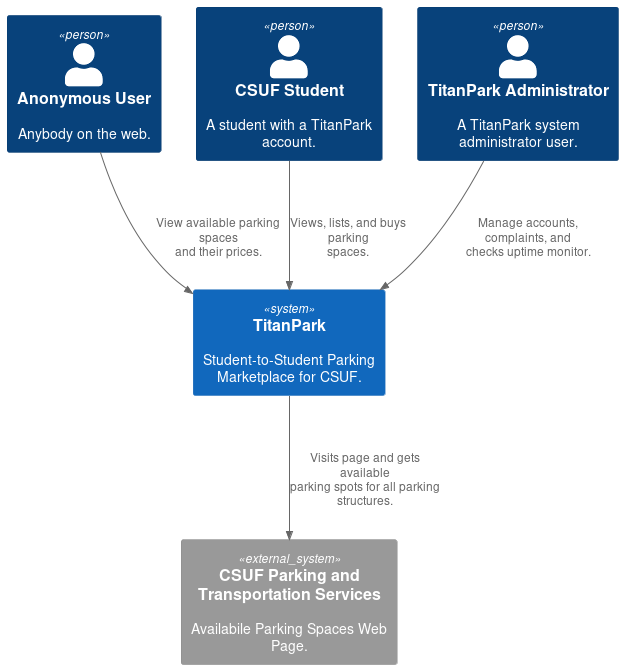
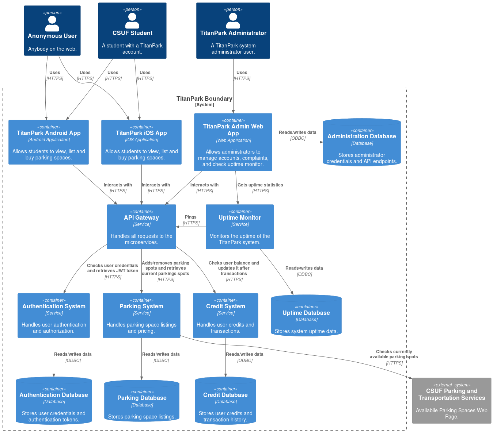
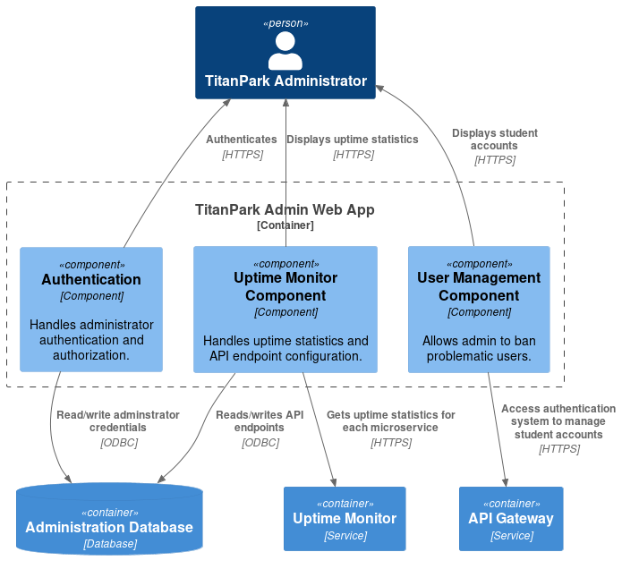

# Titan Park Documentation

## Table of Contents

- [Resources](#resources)
- [Contributing](#contributing)
- [System Architecture](#system-architecture)
  - [Level 1: System Context](#level-1-system-context)
  - [Level 2: Containers](#level-2-containers)
  - [Level 3: Components](#level-3-components)
    - [TitanPark Admin Web App Components](#titanpark-admin-web-app-components)

## Resources

Will will be using the C4 model for visualizing software architecture and PlantUML to implement the C4 model.
Below are some guides to get familiar with the C4 model, PlantUML, and microservices.

- [Microservices](https://martinfowler.com/articles/microservices.html) - Martin Fowler blog explaining what microservices are
- [Drawing UML with PlantUML](https://plantuml.com/guide) - PlantUML guide
- [C4-PlantUML](https://github.com/plantuml-stdlib/C4-PlantUML) - Documentation for using C4 library in PlantUML
- [Visualising software architecture](https://static.codingthearchitecture.com-visualising-software-architecture.pdf) - C4 model guide + example
- [YouTube: The Art of Visualising Software Architecture (Simon Brown)](https://www.youtube.com/watch?v=zcmU-OE452k) - Creator of C4 model explains what C4 model is

## Contributing

To contribute component diagrams to this repository, follow these steps:

### 1. Install PlantUML VS Code Extension
- **VS Code**: Install the [PlantUML extension](https://marketplace.visualstudio.com/items?itemName=jebbs.plantuml).

### 2. Create a New Component Diagram
1. Navigate to the `diagrams/src/` directory in the repository.
2. Create a new `.wsd` file for your diagram (e.g., `C4_Component_[container-name].wsd`).
3. Use the [C4-PlantUML](https://github.com/plantuml-stdlib/C4-PlantUML?tab=readme-ov-file#c4-plantuml) library to define your diagram. For example:
```java
@startuml Components_Admin_Web_App
!include <C4/C4_Container>
!include <C4/C4_Component>

Person(system_admin, "TitanPark Administrator")
Container(api_gateway, "API Gateway", "Service")
Container(uptime_monitor, "Uptime Monitor", "Service")
ContainerDb(admin_db, "Administration Database", "Database")

Container_Boundary(admin_web_app, "TitanPark Admin Web App") {
  Component(admin_auth, "Authentication", "Component", "Handles administrator authentication and authorization.")
  Component(uptime_monitor_comp, "Uptime Monitor Component", "Component", "Handles uptime statistics and API endpoint configuration.")
  Component(user_management_comp, "User Management Component", "Component", "Allows admin to ban problematic users.")
}

Rel_D(admin_auth, admin_db, "Read/write adminstrator credentials", "ODBC")
Rel_U(admin_auth, system_admin, "Authenticates", "HTTPS")
Rel_D(uptime_monitor_comp, uptime_monitor, "Gets uptime statistics for each microservice", "HTTPS")
Rel_D(uptime_monitor_comp, admin_db, "Reads/writes API endpoints", "ODBC")
Rel_U(uptime_monitor_comp, system_admin, "Displays uptime statistics", "HTTPS")
Rel_D(user_management_comp, api_gateway, "Access authentication system to manage student accounts", "HTTPS")
Rel_D(user_management_comp, system_admin, "Displays student accounts", "HTTPS")
@enduml
```

### 3. Generate the Diagram
- Use your text editor's PlantUML plugin in VS Code:
  1. Press `CTRL + SHIFT + P` to open the command palette.
  2. Search for `PlantUML: Export Current Diagram` and select it.
  3. Choose `PNG` as the export format.
- Save the output in the `/diagrams/out` directory.

### 4. Add the Diagram to the Documentation
- Update the relevant section in the `README.md` file to include your new diagram. For example:
  ```markdown
  #### [Container name] Components

  
  ```

### 5. Push Changes to Main
- Commit your changes and push them directly to the `main` branch.

## System Architecture
### Level 1: System Context



### Level 2: Containers



### Level 3: Components

#### TitanPark Admin Web App Components

